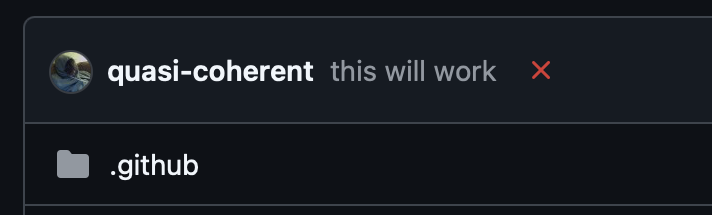

## TODOs

* Be able to run an update to flake inputs, make a signed commit, then open a PR
if there were changes.  I have to think it's running out of ways to not work at this
point.

* nix-community/impermanence
* `dmd/my-keymap` with everything absolutely perfect.
* Oh this is cool, one CLI called `the` that has namespaced subcommands and every CLI
I have, either because I use it or for a reason I don't remember, organized under each
subcommand with help generated from each CLI's help and with autocomplete.
* Oh this too, claude-code but retain a counter that auto replies by decrementing
the counter with a threatening comment whenever it tries to use `gh` or `python3` or
`perl` or `node`.  Like, "You won't be doing this for much longer, only have three
lives left now."
* Why does the theme go back to boring when I quit Spotify?
* Publish some GHA actions/workflows.
* `den` lets you make diagrams of stuff, so do that.  Put it in a folder.  Spend time
trying to do it from GitHub actions; fail entirely.  Come out at the end of the exercise
having not improved at all.
* Templates (general improvement).
* Update WSL2 nixos to work here (probably start over).
* I dunno, control my lightbulbs with nix or some shit.
